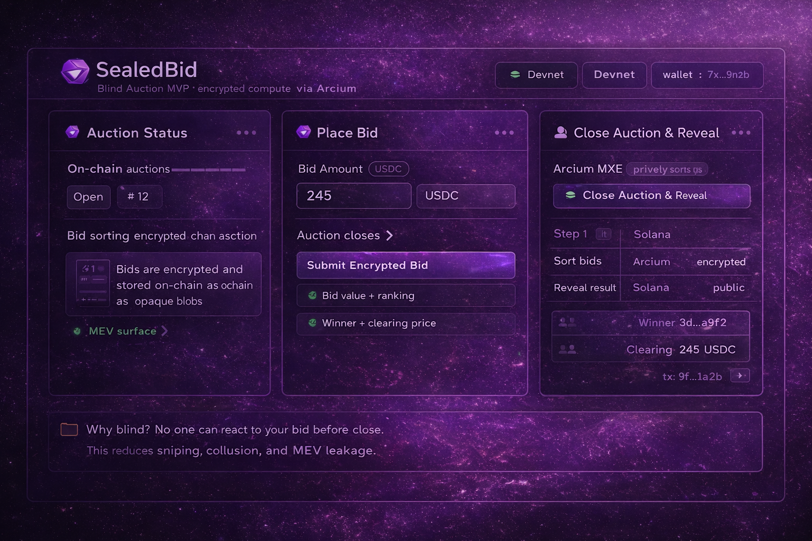

# SealedBid (Solana + Arcium)

SealedBid is a minimal blind auction prototype built on Solana.

Traditional on-chain auctions expose bids in real time, enabling reactive bidding, collusion, and MEV extraction.

SealedBid explores a different model.

All bids are encrypted before submission.  
Bid sorting and winner determination compute privately inside Arcium’s encrypted execution layer (MXE).  
Only the final winner and clearing price are revealed on-chain.

---

## 🧠 The Problem

On-chain auctions are transparent by design.

While transparency improves settlement trust, it also enables:

- Strategic reactive bidding
- Bid shading based on visible competitors
- Collusion between bidders
- MEV and sniping strategies

This reduces fairness in price discovery.

---

## 🔐 The Idea

Instead of exposing bids publicly:

- Bids are encrypted client-side
- Encrypted bids are stored on Solana
- Auction closes
- Arcium MXE privately sorts bids
- Highest valid bid is determined confidentially
- Only winner and clearing price are revealed

---

## 🏗 Architecture Overview

Public Layer (Solana):
- Auction creation
- Encrypted bid storage
- Final settlement

Confidential Layer (Arcium MXE):
- Bid sorting
- Winner computation
- Clearing price calculation

Arcium acts as the confidential execution environment.

---

## 🔄 Execution Flow

1. Auction is created.
2. Users submit encrypted bids.
3. Encrypted bids are stored as opaque data.
4. Auction closes.
5. Arcium privately computes winner.
6. Final result is revealed on-chain.

---

## 🔍 Privacy Model

Encrypted:
- Individual bid values
- Bid ranking
- Bid ordering

Revealed:
- Winning address
- Clearing price

Settlement remains transparent.
Execution remains confidential.

---

## ⚠ Disclaimer

This is a minimal structural prototype for exploration within the Arcium ecosystem.

Not audited. Not production-ready.

---

Built for Arcium RTG.

---

## 🧪 Demo Flow

1. Auction is created.
2. Users submit encrypted bids.
3. Encrypted bids are stored as opaque blobs.
4. Auction closes.
5. Arcium MXE privately sorts bids.
6. Winner and clearing price are revealed on-chain.

This demonstrates how confidential execution can enable fair price discovery.

---

## 🖥 Dashboard Mock

A simple UI mock is included at: `app/index.html`
## 🖥 SealedBid Dashboard Preview

